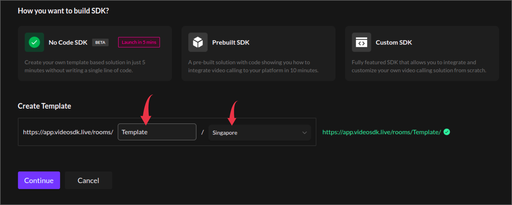
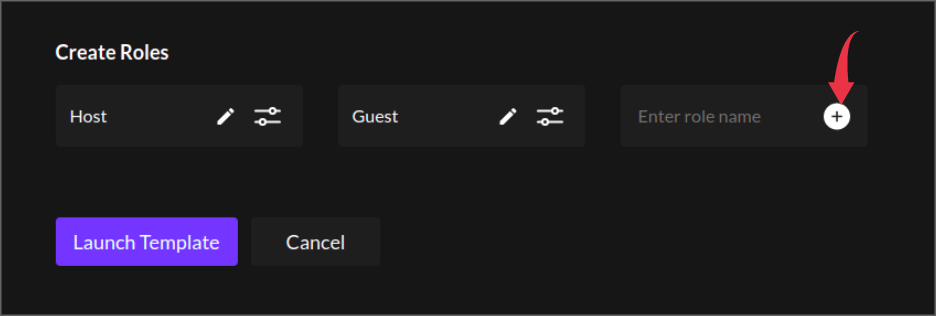
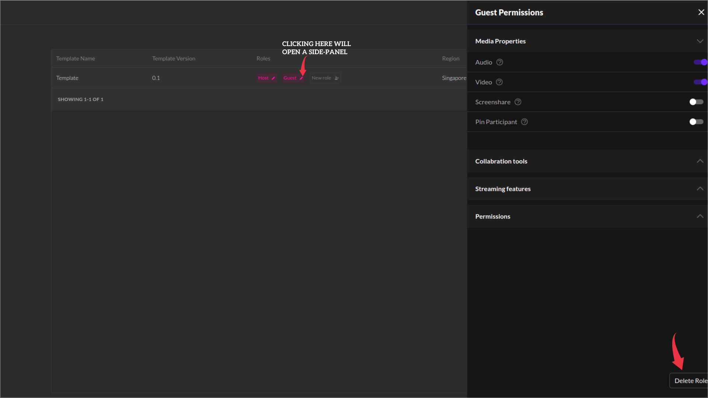

## Introduction

No Code SDK Provides custom template creation facility. You can start Video SDK’s prebuilt audio and video calling app without even writing a code .

Spare your few minutes and get started with videosdk’s prebuilt audio and video calling app.

## Prerequisites

- If you are new to video sdk then create account by referring [https://app.videosdk.live/signup](https://app.videosdk.live/signup) link

## Quick guide

1. Go to [Video SDK Dashboard](https://app.videosdk.live/quick-start)
2. Select No code SDK and click on continue.

   

3. Add Template name and select your nearest region specified in the region combo

   - Naming conventions for template name
     - no space is allowed
     - only - , \_ characters are allowed in addition with [a-z,A-Z,0-9]

   

4. Next step is to create roles for the template specified

   - Let’s say you have created a template named `Template1`
   - You can create roles for Template1 such as Host,Guest etc
   - **Role name should be unique for each template**

   

5. After creating roles you can set permissions for each role.

   - for example `Template1` with 2 roles `Host` and `Guest`
   - Host has all permissions whereas Guests can only toggle their audio and video

   

   By clicking on an icon shown in image above config panel will get populated which look like this

   

   By clicking on toggle button for each permission you can set those permissions true or false.After setting all configuration click on close icon which will auto save all the permissions.

6. Click on launch template to create your template and you will be redirected to the list of your templates page

   

:::note
By Default all templates are activated. You can change template’s state as per your requirement from the template lists.
:::

## How to get started with template?

- From the template list click on get template link to get role wise URL for the specific template. You can get links if that template is in status active.

- Copy the link , open new tab and paste there . By doing so you will get started with Videosdk’s prebuilt video and audio calling.

